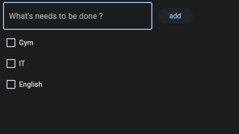

### todo_app.py

### for project run web

<pre><code>flet run --web todo_app.py</code></pre>

### for project run application

<pre><code>flet run todo_app.py</code></pre>
### install library

<pre><code>pip install flet</code></pre>